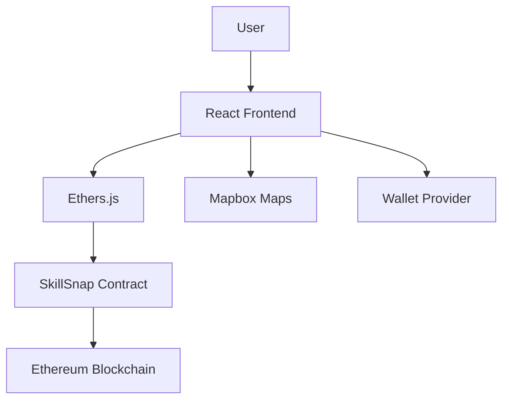

# 🚀 SkillSnap - Decentralized Task Marketplace

**SkillSnap** is a blockchain-powered platform where users can post tasks and get them completed by skilled individuals in their local area. Think of it as a decentralized TaskRabbit with crypto payments, location-based matching, and smart contract automation.

## 🌟 Features

- **🔗 Blockchain Integration**: Smart contracts on Ethereum for secure, trustless transactions
- **🗺️ Location-Based Matching**: Interactive maps to find tasks near you
- **💼 Skill Categories**: Digital services, physical tasks, consulting, and more
- **🔐 Wallet Integration**: Connect with MetaMask, WalletConnect, and other popular wallets
- **💰 Crypto Payments**: Automatic escrow and payments in ETH
- **⭐ Reputation System**: Build trust through completed tasks and reviews
- **📱 Responsive Design**: Works seamlessly on desktop and mobile

## 🏗️ Project Structure

```
skillsnap/
├── smart-contracts/         # Solidity smart contracts
│   ├── contracts/
│   │   └── SkillSnap.sol   # Main contract
│   ├── test/               # Contract tests
│   ├── scripts/            # Deployment scripts
│   └── hardhat.config.js   # Hardhat configuration
├── frontend/               # React + Vite frontend
│   ├── src/
│   │   ├── components/     # Reusable UI components
│   │   ├── pages/          # Application pages
│   │   ├── config.js       # App configuration
│   │   └── App.jsx         # Main App component
│   ├── public/             # Static assets
│   └── package.json        # Frontend dependencies
└── README.md              # This file
```

## 🚀 Quick Start

### Prerequisites

- Node.js (v16 or higher)
- npm or yarn
- MetaMask or another Web3 wallet

### 1. Clone the Repository

```bash
git clone <your-repo-url>
cd skillsnap
```

### 2. Setup Smart Contracts

```bash
cd smart-contracts
npm install
```

Create `.env` file:
```bash
PRIVATE_KEY=your_private_key_here
INFURA_API_KEY=your_infura_key_here
ETHERSCAN_API_KEY=your_etherscan_key_here
```

Compile and test contracts:
```bash
npx hardhat compile
npx hardhat test
```

Deploy to testnet:
```bash
npx hardhat run scripts/deploy.js --network sepolia
```

### 3. Setup Frontend

```bash
cd ../frontend
npm install
```

Create `.env` file:
```bash
VITE_MAPBOX_API=your_mapbox_token_here
VITE_CONTRACT_ADDRESS=deployed_contract_address
VITE_NETWORK_ID=11155111
```

Start development server:
```bash
npm run dev
```

## 🔧 Configuration

### Environment Variables

#### Smart Contracts (.env)
- `PRIVATE_KEY`: Your wallet private key for deployment
- `INFURA_API_KEY`: Infura project API key
- `ETHERSCAN_API_KEY`: For contract verification

#### Frontend (.env)
- `VITE_MAPBOX_API`: Mapbox access token for maps
- `VITE_CONTRACT_ADDRESS`: Deployed smart contract address
- `VITE_NETWORK_ID`: Ethereum network ID (11155111 for Sepolia)

### API Keys Setup

1. **Mapbox**: Get a free API key at [mapbox.com](https://www.mapbox.com/)
2. **Infura**: Create a project at [infura.io](https://infura.io/)
3. **Etherscan**: Get API key at [etherscan.io](https://etherscan.io/apis)

## 📋 Smart Contract Features

### Core Functions

- `createTask()`: Post a new task with escrow
- `acceptTask()`: Accept an available task
- `completeTask()`: Mark task as completed and release payment
- `cancelTask()`: Cancel a posted task
- `raiseDispute()`: Initiate dispute resolution

### Security Features

- Escrow system for secure payments
- Role-based access control
- Emergency pause functionality
- Anti-reentrancy protection

## 🎯 Usage Examples

### Posting a Task

```javascript
// Frontend interaction
const tx = await skillSnapContract.createTask(
  "Help me move furniture",
  "Need help moving couch and boxes",
  "Boston, MA",
  "Physical",
  deadline,
  { value: ethers.utils.parseEther("0.05") }
);
```

### Accepting a Task

```javascript
const tx = await skillSnapContract.acceptTask(taskId);
```

## 🛣️ Roadmap

- [ ] **Phase 1**: Core marketplace functionality ✅
- [ ] **Phase 2**: Reputation system and reviews
- [ ] **Phase 3**: Multi-token payments (USDC, DAI)
- [ ] **Phase 4**: Mobile app (React Native)
- [ ] **Phase 5**: DAO governance for disputes
- [ ] **Phase 6**: Integration with major gig platforms

## 🤝 Contributing

We welcome contributions! Please see our [Contributing Guide](CONTRIBUTING.md) for details.

### Development Setup

1. Fork the repository
2. Create a feature branch: `git checkout -b feature/your-feature`
3. Commit changes: `git commit -am 'Add some feature'`
4. Push to branch: `git push origin feature/your-feature`
5. Submit a pull request

## 📄 License

This project is licensed under the MIT License - see the [LICENSE](LICENSE) file for details.

## 🔍 Testing

### Smart Contracts
```bash
cd smart-contracts
npx hardhat test
npx hardhat coverage
```

### Frontend
```bash
cd frontend
npm test
npm run test:e2e
```

## 📊 Architecture



## 🆘 Support

- **Documentation**: [docs.skillsnap.dev](https://docs.skillsnap.dev)
- **Discord**: [Join our community](https://discord.gg/skillsnap)
- **Twitter**: [@SkillSnapDeFi](https://twitter.com/SkillSnapDeFi)
- **Email**: support@skillsnap.dev

## 🏆 Acknowledgments

- OpenZeppelin for secure smart contract patterns
- Hardhat for development framework
- React and Vite for frontend framework
- Mapbox for location services

---

**Built with ❤️ for the decentralized future**
